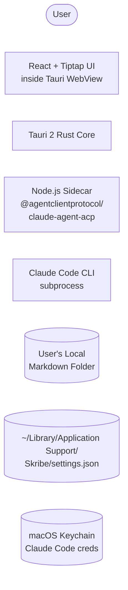

# PRD — Skribe

## 1. Overview

### Product Summary

**Skribe** is the markdown writing app for people who build with AI. It is a Mac-native desktop application (Tauri 2 + React) that opens a local folder, presents every markdown file in a left-side file tree, and renders the active file in a Notion-style WYSIWYG editor (Tiptap) in the middle pane. At the bottom of the editor is an AI input bar that sends commands via the Agent Client Protocol (ACP) to a Claude Code subprocess running in the open folder, with full project context. The agent edits the active document directly, streaming changes into the editor in real time. When ambiguous, the agent surfaces a clarification popup before applying changes. Authentication is zero-config — Skribe inherits the user's existing Claude Code terminal login.

### Objective

This PRD covers the MVP of Skribe as defined in `docs/product-vision.md` § Product Strategy. The MVP scope is intentionally tight: open a local folder, edit markdown beautifully, command-line an agent (Claude Code, via ACP) to edit the document for you. Right-panel widgets, hosted MCP server, multi-folder workspaces, cloud sync, mobile/web versions, plugin marketplaces, and PDF/DOCX export are explicitly out of scope.

### Market Differentiation

Technically, Skribe must deliver three things competitors do not have together: (a) a beautiful Notion-style WYSIWYG markdown editor with bidirectional markdown round-trip; (b) a stable, low-latency ACP integration that streams agent edits into the editor in real time; (c) zero-config Claude Code authentication that inherits from the user's existing terminal login. If any of these three is missing or rough, the differentiation collapses into "another markdown editor." The implementation bar is craft-grade across all three.

### Magic Moment

The user opens Skribe in a project folder, types into the AI bar — *"rewrite this README to match the tone of my other docs in this folder"* — and watches Claude Code stream a transformed document into the editor in real time, in their voice, picked up from their other files. To enable this:

- Folder loading is instantaneous — no progress bars, no spinners.
- Tauri spawns the Node ACP sidecar at app launch (or on first folder open) so the subprocess is warm.
- The first prompt-to-first-token latency is &lt; 2 seconds on a healthy network.
- Streaming text arrives smoothly into the Tiptap editor without flicker, with markdown parsed progressively as it lands.
- The clarification popup, when triggered, appears next to the AI bar within \~100ms of the `user_input_required` event.
- The Claude Code login pre-flight check happens once at app launch and is cached for the session.

### Success Criteria

- **Time to first edit**: &lt; 30 seconds from app launch to first character typed in the editor (assuming Claude Code is installed and logged in).
- **Time to magic moment**: &lt; 60 seconds from app launch to first streaming token from the agent.
- **AI input first-token latency**: &lt; 2s p95 on a healthy network, in a folder of &lt; 50 markdown files.
- **Editor write performance**: keypress → on-screen render &lt; 16ms (60fps), even in 10K-word documents.
- **App bundle size**: &lt; 15MB for the universal Mac binary (.dmg notarized).
- **App startup time**: &lt; 1s cold start to interactive on a 2020+ Mac.
- **All P0 functional requirements implemented and manually verified.**
- **Zero crashes** in a 1-hour scripted test session covering all major flows.

---

## 2. Technical Architecture

### Architecture Overview



```
User --&gt; UI
UI &lt;--&gt;|Tauri IPC&lt;br/&gt;commands + events| Rust
Rust --&gt;|spawns + stdio| NodeSidecar
NodeSidecar --&gt;|spawns + stdio| ClaudeCode
Rust --&gt;|read/write fs| Folder
Rust --&gt;|read/write json| Settings
ClaudeCode --&gt;|reads&lt;br/&gt;folder context| Folder
ClaudeCode --&gt;|reads creds| Keychain</code></pre><p>The user interacts with React UI inside the Tauri WebView. Tauri's Rust core handles file system I/O on the open folder, manages settings, and supervises the Node sidecar. The Node sidecar runs <code>@agentclientprotocol/claude-agent-acp</code>, which spawns the Claude Code CLI as a subprocess and exposes JSON-RPC stdio. Claude Code authenticates via the user's existing macOS keychain credentials and reads files from the same folder. Stdio between the React UI and Claude Code is relayed by Rust, so the entire chain is transparent to the user.</p><h3>Chosen Stack</h3><table><thead><tr><th>Layer</th><th>Choice</th><th>Rationale</th></tr></thead><tbody><tr><td>Frontend</td><td>React + TypeScript + Vite (inside Tauri 2 webview), styled with Tailwind CSS and a small custom component layer. Tiptap (built on ProseMirror) with the markdown extension for the WYSIWYG editor.</td><td>React + TS + Vite is the standard for modern Tauri apps and maximally fluent for AI coding tools. Tailwind keeps styling fast without locking into a heavy component library. Tiptap powers Notion-style WYSIWYG with bidirectional markdown round-tripping out of the box.</td></tr><tr><td>Backend</td><td>Tauri 2 (Rust core).</td><td>Tauri ships ~10MB native macOS apps via system WebKit. The Rust core gives Skribe a robust home for file system management, Node sidecar supervision, and stdio relay. Cross-platform path to Windows/Linux is preserved.</td></tr><tr><td>Database</td><td>None — JSON config files in <code>~/Library/Application Support/Skribe/</code>.</td><td>User documents are markdown files on disk; never imported, indexed, or re-stored. App settings stored as JSON. On-brand: local-first, file-as-source-of-truth.</td></tr><tr><td>Auth</td><td>None — Claude Code authentication is inherited from the user's existing terminal login via macOS keychain.</td><td>Skribe is a local app with no accounts. When Skribe spawns Claude Code, it uses the user's existing keychain credentials. Skribe never sees an API key.</td></tr><tr><td>Payments</td><td>None — Skribe is MIT-licensed open source.</td><td>No in-app purchases. Future GitHub Sponsors link if user support added later.</td></tr></tbody></table><h3>Stack Integration Guide</h3><p><strong>Setup order:</strong></p><ol><li>Install Rust toolchain (<code>rustup</code> with stable channel) and Node.js 20+.</li><li>Install Tauri 2 prerequisites for macOS (Xcode Command Line Tools).</li><li>Scaffold the project: <code>npm create tauri-app@latest skribe -- --template react-ts</code>.</li><li>Install frontend deps: <code>npm install @tiptap/react @tiptap/starter-kit @tiptap/extension-link @tiptap/extension-placeholder @tiptap/extension-typography tiptap-markdown phosphor-react clsx zustand</code>.</li><li>Install Tailwind: <code>npm install -D tailwindcss postcss autoprefixer &amp;&amp; npx tailwindcss init -p</code>.</li><li>Install fonts via npm: <code>npm install @fontsource/source-serif-4 @fontsource/inter @fontsource/jetbrains-mono</code>.</li><li>Install ACP sidecar dep: <code>npm install @agentclientprotocol/claude-agent-acp</code> (latest, minimum v0.31.2 to avoid the April 2026 breaking changes).</li><li>Configure Tauri to bundle Node + the ACP package as a sidecar resource.</li><li>Add Rust crates to <code>src-tauri/Cargo.toml</code>: <code>tokio</code>, <code>serde</code>, <code>serde_json</code>, <code>tauri-plugin-fs</code>, <code>tauri-plugin-dialog</code>, <code>tauri-plugin-shell</code> (for spawning Node sidecar).</li></ol><p><strong>Known integration patterns:</strong></p><ul><li><strong>Tauri ↔ React communication</strong>: use Tauri's <code>invoke()</code> from JS for synchronous Rust calls; use <code>emit/listen</code> for async events (file changes, ACP streaming tokens).</li><li><strong>Tiptap ↔ markdown</strong>: configure <code>tiptap-markdown</code> extension to round-trip cleanly. Watch for edge cases in nested lists, code fences, and HTML passthrough.</li><li><strong>Node sidecar lifecycle</strong>: spawn on first folder open (not on app launch) to keep cold-start fast. Kill the sidecar gracefully when the user changes folders or closes the app.</li><li><strong>Claude Code detection</strong>: at app launch, run <code>which claude</code> (via <code>tauri-plugin-shell</code>) to verify Claude Code is on PATH and capture its version. Cache for the session.</li></ul><p><strong>Common gotchas:</strong></p><ul><li>macOS sandboxing: Tauri apps default to a tight sandbox. Ensure <code>tauri.conf.json</code> capabilities allow reading/writing in user-selected folders only (security scope is per-folder).</li><li>ACP version drift: pin a known-good minimum and gracefully reject older versions.</li><li>Tiptap markdown round-trip: the default markdown extension does not preserve all edge cases (e.g. raw HTML). Test thoroughly with realistic README files.</li><li>Node sidecar code signing: ensure the bundled Node binary is properly signed and notarized as part of the app bundle.</li></ul><p><strong>Required environment variables:</strong> none. Skribe has no <code>.env</code> file in production. Build-time variables (e.g. version string) are passed via Tauri's standard configuration.</p><h3>Repository Structure</h3><pre><code>skribe/
```

`├── src/                                # React frontend (TypeScript)
│   ├── App.tsx                         # Root component, layout shell
│   ├── main.tsx                        # Vite entry
│   ├── components/
│   │   ├── editor/
│   │   │   ├── Editor.tsx              # Tiptap editor wrapper
│   │   │   ├── EditorToolbar.tsx       # Optional formatting toolbar
│   │   │   ├── extensions.ts           # Tiptap extension config
│   │   │   └── markdown.ts             # Markdown round-trip helpers
│   │   ├── filetree/
│   │   │   ├── FileTree.tsx            # Left pane file tree
│   │   │   └── FileItem.tsx            # Single file row
│   │   ├── ai/
│   │   │   ├── AIInputBar.tsx          # Bottom AI input bar
│   │   │   └── ClarificationPopup.tsx  # user_input_required popup
│   │   ├── status/
│   │   │   └── StatusLine.tsx          # Word count + reading time
│   │   ├── chrome/
│   │   │   ├── EmptyState.tsx          # No-folder-open state
│   │   │   ├── Settings.tsx            # Settings modal
│   │   │   └── PreflightCheck.tsx      # Claude Code detection prompt
│   │   └── ui/                         # Custom design system primitives
│   │       ├── Button.tsx
│   │       ├── Input.tsx
│   │       ├── Modal.tsx
│   │       └── Tooltip.tsx
│   ├── stores/
│   │   ├── folderStore.ts              # Zustand: open folder + file list
│   │   ├── editorStore.ts              # Zustand: active document state
│   │   ├── aiStore.ts                  # Zustand: AI session state
│   │   └── settingsStore.ts            # Zustand: app settings
│   ├── lib/
│   │   ├── tauri.ts                    # Typed Tauri command wrappers
│   │   ├── acp.ts                      # ACP message types + helpers
│   │   ├── markdown.ts                 # Markdown utilities
│   │   └── readability.ts              # Word count + reading time
│   ├── styles/
│   │   ├── tokens.css                  # CSS custom properties (design tokens)
│   │   └── global.css                  # Global styles + Tailwind directives
│   └── types/
│       └── index.ts                    # Shared TS types
├── src-tauri/                          # Rust backend
│   ├── src/
│   │   ├── main.rs                     # Tauri entry
│   │   ├── commands/
│   │   │   ├── fs.rs                   # File system commands (open, read, write, watch)
│   │   │   ├── settings.rs             # App settings commands
│   │   │   ├── claude.rs               # Claude Code detection command
│   │   │   └── acp.rs                  # ACP sidecar lifecycle commands
│   │   ├── sidecar.rs                  # Node sidecar spawn/kill/relay
│   │   ├── watcher.rs                  # File system watcher
│   │   └── settings.rs                 # Settings persistence
│   ├── Cargo.toml
│   ├── tauri.conf.json
│   ├── icons/                          # macOS app icons
│   └── resources/
│       └── acp-sidecar/                # Bundled Node + ACP package
├── public/
├── docs/
│   ├── product-vision.md
│   ├── prd.md
│   ├── product-roadmap.md
│   └── gtm.md
├── vision.json
├── package.json
├── tsconfig.json
├── tailwind.config.ts
├── vite.config.ts
├── README.md
├── LICENSE                              # MIT
└── CONTRIBUTING.md`

### Infrastructure & Deployment

**Build:** `npm run tauri build` produces a universal Mac binary (Intel + Apple Silicon). The output is a notarized `.dmg` containing `Skribe.app`.

**Code signing:** Apple Developer ID required ($99/year). Configure signing identity in `tauri.conf.json`. Use `tauri-action` or manual flow for notarization.

**Distribution:**

- Primary: GitHub Releases (`.dmg` artifact attached to each tagged release).
- Secondary (post-MVP): a simple landing page at `skribe.app` (or similar) with a "Download for Mac" button pointing to the latest release.
- Tertiary (post-MVP): Homebrew Cask formula for `brew install --cask skribe`.

**Auto-update:** use Tauri's built-in updater plugin. The updater checks a manifest hosted on GitHub Pages or a CDN and downloads the latest `.dmg.tar.gz` signed bundle.

**CI/CD:** GitHub Actions workflow that builds on push to `main`, runs lint + type-check + test, and on tagged releases produces a notarized binary uploaded as a release asset.

**Required environment variables for build:**

- `APPLE_ID`, `APPLE_PASSWORD` (or `APPLE_API_KEY`), `APPLE_TEAM_ID` — for notarization (CI secrets only)
- `TAURI_PRIVATE_KEY`, `TAURI_KEY_PASSWORD` — for signing the auto-update bundle
- `GITHUB_TOKEN` — for publishing releases

### Security Considerations

**Local-only model.** Skribe is a local-first app. No data leaves the user's machine except via the Claude Code subprocess (which the user has already independently configured). No telemetry, no analytics, no crash reporting in MVP.

**Tauri sandbox:** apps default to restricted file system access. The user explicitly grants access to their selected folder via macOS's native folder picker. Skribe stores the security-scoped bookmark and re-establishes the access scope on each app launch.

**Process isolation:** the Node sidecar and Claude Code subprocess run as separate processes from Tauri's Rust core. If either crashes, the editor remains usable; the AI bar shows a graceful error state.

**Input validation:** user input from the AI bar is passed verbatim to Claude Code. No shell escaping is required because the protocol is JSON-RPC, not shell. File paths from the file tree are validated to be within the open folder before any read/write.

**Auto-update security:** Tauri's updater requires signed update manifests. Use a Tauri-generated keypair, store the private key in CI secrets, ship the public key bundled in the app.

**Notarization:** required for distribution outside the App Store. Macs running macOS 13+ otherwise refuse to launch. CI workflow handles notarization on tagged releases.

**Threat model:** Skribe trusts the user's local folder and the Claude Code binary on their PATH. It does not trust the network for anything except auto-update manifest fetches (which are signed). It does not trust Claude Code's subprocess to behave maliciously, but it sandboxes its file system access to the open folder via the Rust core.

### Cost Estimate

Skribe has effectively zero infrastructure cost.

| Item | Monthly cost | Notes |
| --- | --- | --- |
| Apple Developer Program | $8.25 | $99/year prorated |
| Domain (skribe.app or similar) | $1–2 | Annual registration prorated |
| GitHub | $0 | Public repo, free tier |
| GitHub Releases (download bandwidth) | $0 | Free for public repos |
| Landing page hosting | $0 | GitHub Pages or Cloudflare Pages free tier |
| Auto-update manifest hosting | $0 | GitHub Pages |
| **Total** | **\~$10/month** |  |

User-side costs: a Claude Pro / Claude Code subscription (which the user already has if they use Claude Code at all). Skribe does not pay any AI API costs because the user's Claude Code login is the runtime credential.

---

## 3. Data Model

### Entity Definitions

Skribe has minimal application state. The "data model" is mostly local app settings and ephemeral runtime state. User documents are markdown files on disk and are never modeled as entities.

`AppSettings` **— persisted to** `~/Library/Application Support/Skribe/settings.json`

```typescript
interface AppSettings {
schemaVersion: 1;                            // For future migrations
recentFolders: string[];                     // Absolute paths, max 10, most-recent-first
lastOpenedFolder: string | null;             // Absolute path of the folder open at last quit
editor: {
fontSize: number;                          // 14, 16, 18, 20 (default 18)
accentColor: 'deep-ink' | 'deep-green';    // Default 'deep-ink'
lineHeight: number;                        // 1.5, 1.7, 1.9 (default 1.7)
};
ui: {
fileTreeWidth: number;                     // 200–360 (default 240)
showStatusLine: boolean;                   // Default true
};
ai: {
autoFocusInputOnFolderOpen: boolean;       // Default false
};
preflight: {
claudeCodeDetected: boolean;               // Cached result
claudeCodeVersion: string | null;          // Cached version string
lastDetectedAt: number;                    // Unix ms timestamp
};
}
```

`OpenFolder` **— runtime, in memory only (not persisted as a separate file)**

```typescript
interface OpenFolder {
path: string;                                // Absolute path
files: MarkdownFile[];                       // All .md and .markdown files in the folder
watcher: FsWatcher | null;                   // Native file watcher
}
```

`interface MarkdownFile {
path: string;                                // Absolute path
relativePath: string;                        // Relative to OpenFolder.path
name: string;                                // File name with extension
size: number;                                // Bytes
modifiedAt: number;                          // Unix ms timestamp
}`

`ActiveDocument` **— runtime, in memory only**

```typescript
interface ActiveDocument {
filePath: string;                            // Absolute path
content: string;                             // Current markdown content
isDirty: boolean;                            // Unsaved changes
lastSavedAt: number | null;                  // Unix ms timestamp
cursorPosition: number;                      // ProseMirror position
}
```

`AISession` **— runtime, in memory only**

```typescript
interface AISession {
status: 'idle' | 'submitting' | 'streaming' | 'awaiting_clarification' | 'error';
prompt: string;                              // Last submitted prompt
partialResponse: string;                     // Streaming buffer
pendingClarification: {
question: string;
options: ClarificationOption[];
} | null;
error: string | null;
}
```

`interface ClarificationOption {
id: string;
label: string;
description?: string;
}`

### Relationships

There are no relational tables. Runtime state is held in Zustand stores in the React layer:

- `folderStore` owns the `OpenFolder`.
- `editorStore` owns the `ActiveDocument`.
- `aiStore` owns the `AISession`.
- `settingsStore` owns the `AppSettings` and persists to disk via Tauri.

When the user clicks a file in the file tree, `editorStore` loads the file's content via a Tauri command, the Tiptap editor reflects the content, and `editorStore.isDirty` is set to false. On every keystroke, `editorStore.content` updates and `isDirty` becomes true. A debounced (500ms) save call writes the file via Tauri and resets `isDirty` to false.

### Indexes

No indexes (no database). The file watcher's notifications are sufficient to keep the in-memory file list fresh. For folders with &gt; 1000 markdown files (rare), the file tree uses virtualized rendering to maintain performance.

---

## 4. API Specification

### API Design Philosophy

Skribe's "API" is a Tauri command interface — typed Rust functions exposed to the React frontend via `invoke()`. There is no HTTP API, no REST endpoints, no GraphQL. Communication patterns:

- **Sync request/response (commands):** the frontend invokes a Rust command and awaits a typed result. Used for file operations, settings, Claude Code detection.
- **Async events (emit/listen):** the Rust core emits events the frontend subscribes to. Used for streaming ACP tokens, file watcher notifications, sidecar lifecycle events.

**Error format:** Rust commands return `Result<T, AppError>` where `AppError` is a typed enum serialized as `{ code: string, message: string }` to the frontend.

```typescript
type AppError =
| { code: 'FS_PERMISSION_DENIED'; message: string }
| { code: 'FS_NOT_FOUND'; message: string }
| { code: 'FS_INVALID_PATH'; message: string }
| { code: 'CLAUDE_NOT_INSTALLED'; message: string }
| { code: 'CLAUDE_NOT_LOGGED_IN'; message: string }
| { code: 'ACP_SIDECAR_FAILED'; message: string }
| { code: 'ACP_PROTOCOL_ERROR'; message: string }
| { code: 'SETTINGS_INVALID'; message: string }
| { code: 'INTERNAL'; message: string };
```

### Commands (Rust → frontend, invoked via `invoke()`)

**File system commands**

```typescript
// Open a folder picker and return the selected path (or null if cancelled).
invoke<string | null>('fs_pick_folder')
```

`// List all .md and .markdown files in a folder, recursively (depth-limited to 5).
invoke<MarkdownFile[]>('fs_list_markdown_files', { folderPath: string })`

`// Read a markdown file's content.
invoke<string>('fs_read_file', { filePath: string })`

`// Write content to a file (atomic write — write to temp, then rename).
invoke<void>('fs_write_file', { filePath: string, content: string })`

`// Create a new markdown file with empty content.
invoke<MarkdownFile>('fs_create_file', { folderPath: string, fileName: string })`

`// Rename a markdown file.
invoke<MarkdownFile>('fs_rename_file', { oldPath: string, newName: string })`

`// Delete a markdown file (moves to Trash via macOS API).
invoke<void>('fs_delete_file', { filePath: string })`

`// Start watching a folder for file changes.
invoke<void>('fs_watch_folder', { folderPath: string })`

`// Stop watching the current folder.
invoke<void>('fs_unwatch_folder')`

**Settings commands**

```typescript
// Read app settings from disk. Returns defaults if not present.
invoke<AppSettings>('settings_load')
```

`// Write app settings to disk.
invoke<void>('settings_save', { settings: AppSettings })`

`// Add a folder to recent folders, capped at 10.
invoke<AppSettings>('settings_add_recent_folder', { folderPath: string })`

**Claude Code detection**

```typescript
// Check whether Claude Code is installed and logged in.
// Runs which claude and claude --version, validates output.
invoke<{ installed: boolean; version: string | null; loggedIn: boolean }>('claude_preflight')
```

**ACP commands**

```typescript
// Spawn the ACP sidecar pointed at the current folder.
// Returns the ACP session ID for subsequent calls.
invoke<{ sessionId: string }>('acp_start', { folderPath: string })
```

`// Send a user prompt to the active ACP session.
invoke<void>('acp_send_prompt', { sessionId: string, prompt: string, activeFilePath: string })`

`// Send the user's clarification response back to the agent.
invoke<void>('acp_respond_clarification', { sessionId: string, optionId: string | null, response: string | null })`

`// Cancel the current ACP request and any in-flight streaming.
invoke<void>('acp_cancel', { sessionId: string })`

`// Shut down the ACP sidecar.
invoke<void>('acp_stop', { sessionId: string })`

### Events (Rust → frontend, subscribed via `listen()`)

**File watcher events**

```typescript
// Emitted when a file in the open folder is created, modified, or deleted.
listen<{ event: 'created' | 'modified' | 'deleted'; path: string }>('fs:change', handler)
```

**ACP streaming events**

```typescript
// Streaming text delta from the agent — append to the active document.
listen<{ sessionId: string; delta: string }>('acp:text_delta', handler)
```

`// Agent has emitted a tool call (e.g. read_file, write_file). Surface for transparency only.
listen<{ sessionId: string; tool: string; args: object }>('acp:tool_call', handler)`

`// Agent requires user input (clarification or option selection).
listen<{
sessionId: string;
question: string;
options: ClarificationOption[];
freeForm: boolean;
}>('acp:user_input_required', handler)`

`// Agent has completed its response.
listen<{ sessionId: string; status: 'ok' | 'error'; error?: string }>('acp:complete', handler)`

`// Sidecar status changed.
listen<{ sessionId: string; status: 'starting' | 'ready' | 'crashed' | 'stopped' }>('acp:status', handler)`

### ACP Protocol Reference

Skribe communicates with Claude Code through `@agentclientprotocol/claude-agent-acp`, which itself implements ACP over JSON-RPC 2.0 stdio. Skribe's Rust core does not parse JSON-RPC directly — it relays bytes between the Node sidecar and the frontend, with light protocol awareness for converting ACP events into typed Tauri events. Key ACP message types Skribe relies on (subject to change with ACP version):

- `initialize` (Skribe → agent): version negotiation, client capabilities.
- `agent/request` (Skribe → agent): user prompt + working folder path.
- `agent/message` (agent → Skribe): streaming text deltas, tool calls, completion.
- `session/event` (agent → Skribe): includes `user_input_required` for clarifications, `models_available` for model picker (post-MVP), and lifecycle events (logged but not surfaced to user in MVP).

Skribe pins minimum ACP version to v0.31.2 to avoid the April 2026 breaking changes (model alias rename, dynamic model payload, compaction stream).

---

## 5. User Stories

### Epic: First-Run Onboarding

**US-001: Open the app for the first time**

As Maya (a Builder-in-Public Creator), I want to open Skribe and see a clean, inviting first screen, so that I immediately understand what to do next.

Acceptance Criteria:

- [ ]  Given Skribe has never been launched, when the app opens, then the empty state displays the Skribe wordmark, a one-sentence description, and a single "Open folder" button.

- [ ]  Given the empty state is showing, when the user clicks "Open folder", then the native macOS folder picker appears.

- [ ]  Given Claude Code is not installed, when the empty state loads, then a non-blocking notice appears with a link to install Claude Code.

- [ ]  Edge case: app launched on a machine without Claude Code → editor still works, AI bar is disabled with a tooltip explaining why.

**US-002: Pre-flight check for Claude Code**

As Maya, I want Skribe to silently check that Claude Code is installed and logged in, so that I am not interrupted with credential prompts later.

Acceptance Criteria:

- [ ]  Given Skribe launches, when the pre-flight check runs, then it completes within 1 second.

- [ ]  Given Claude Code is installed and logged in, when pre-flight completes, then no UI is shown.

- [ ]  Given Claude Code is missing, when pre-flight completes, then a dismissible banner explains the issue with a "Learn how to install Claude Code" link.

- [ ]  Given Claude Code is installed but not logged in, when pre-flight completes, then a banner shows `claude login` as the recommended fix.

### Epic: Folder & File Management

**US-003: Open a project folder**

As Maya, I want to point Skribe at a folder of markdown files, so that I can edit them.

Acceptance Criteria:

- [ ]  Given the user clicks "Open folder", when they select a folder in the picker, then Skribe loads the file tree showing all `.md` and `.markdown` files (recursively, max depth 5).

- [ ]  Given a folder is opened, when the load completes, then the first file alphabetically is opened in the editor and focused.

- [ ]  Given a folder is opened, when the user opens a different folder via the menu, then the previous folder is closed (with a save prompt if there are unsaved changes).

- [ ]  Edge case: folder with 0 markdown files → file tree shows an empty state with a "Create new file" button.

- [ ]  Edge case: folder with 1000+ markdown files → file tree virtualizes rendering and remains responsive.

**US-004: Browse files in the tree**

As Maya, I want to navigate my markdown files easily, so that I can switch between drafts quickly.

Acceptance Criteria:

- [ ]  Given the file tree is populated, when the user clicks a file, then the editor loads that file's content within 100ms.

- [ ]  Given the file tree is populated, when the user uses ↑/↓ keys, then the selection moves between files and the editor updates accordingly.

- [ ]  Given a file in the tree is dirty (unsaved), then a small dot indicator appears next to its name.

- [ ]  Edge case: clicking a file that has been deleted externally → toast notification, file removed from tree.

**US-005: Create, rename, and delete files**

As Maya, I want to create new markdown files, rename them, and delete the ones I don't need, so that my folder stays organized.

Acceptance Criteria:

- [ ]  Given a folder is open, when the user hits ⌘N, then a new file is created (default name `Untitled.md`, deduped if needed) and opened in the editor.

- [ ]  Given the user right-clicks a file in the tree, when the context menu appears, then it offers "Rename" and "Delete" options.

- [ ]  Given the user renames a file, when the rename completes, then the file is renamed on disk and the tree updates.

- [ ]  Given the user deletes a file, when confirmed, then the file is moved to the macOS Trash (not permanently deleted) and the tree updates.

### Epic: Writing & Editing

**US-006: Write in a beautiful WYSIWYG editor**

As Maya, I want a Notion-style editor that hides markdown syntax, so that I can focus on writing without seeing asterisks and pound signs.

Acceptance Criteria:

- [ ]  Given the editor is loaded, when the user types `# Heading`, then the line transforms into a styled heading and the markdown syntax disappears.

- [ ]  Given the user is in a heading, when they hit Enter, then the next line returns to body text.

- [ ]  Given the user types `bold`, then the text becomes bold inline as they finish typing.

- [ ]  Given the editor is loaded, when the user types, then keystroke-to-render latency is &lt; 16ms.

- [ ]  Given the user closes Skribe and reopens the file in another tool, then the file is plain markdown — no Skribe-specific syntax or metadata.

**US-007: Auto-save**

As Maya, I want Skribe to save my work continuously, so that I never lose what I've typed.

Acceptance Criteria:

- [ ]  Given the user edits a document, when they pause typing for 500ms, then the file is auto-saved to disk.

- [ ]  Given a save is in progress, when the user makes another edit, then the previous save is cancelled and a new one is debounced.

- [ ]  Given a save completes, when the file is on disk, then it is written atomically (write-to-temp + rename) to prevent corruption.

- [ ]  Given a save fails (e.g. permission denied), when the failure occurs, then a non-modal error notification appears and the user is prompted to save manually.

### Epic: AI-Powered Editing

**US-008: Send a command to the AI**

As Maya, I want to type a natural-language instruction in the AI bar and have it edit my document, so that I can move faster.

Acceptance Criteria:

- [ ]  Given the editor has an active document, when the user types in the AI bar and hits Enter, then the prompt is submitted via ACP within 100ms.

- [ ]  Given the prompt is submitted, when the agent begins streaming, then the first token appears in the editor within 2s p95.

- [ ]  Given streaming is in progress, when the user types in the editor, then the editor remains usable but warns that incoming AI changes may conflict.

- [ ]  Given streaming completes, when the document settles, then it is auto-saved.

- [ ]  Edge case: user submits an empty prompt → submit button is disabled.

- [ ]  Edge case: ACP sidecar crashes mid-stream → editor preserves the partial content, error toast appears, AI bar resets.

**US-009: Receive a clarification popup**

As Maya, when the agent has multiple valid options or an ambiguous instruction, I want it to ask me before making changes, so that I stay in control.

Acceptance Criteria:

- [ ]  Given the agent emits `user_input_required`, when the event arrives, then a popup appears anchored near the AI bar within 100ms.

- [ ]  Given the popup is showing, when the user clicks an option, then the agent resumes with that choice and streaming continues.

- [ ]  Given the popup is showing, when the user types a free-form response (if `freeForm: true`), then the agent receives that text.

- [ ]  Given the popup is showing, when the user hits Escape, then the AI request is cancelled.

**US-010: Cancel an in-flight AI request**

As Maya, when the AI starts going in the wrong direction, I want to stop it immediately, so that I don't have to wait for it to finish.

Acceptance Criteria:

- [ ]  Given streaming is in progress, when the user clicks the cancel button (or hits Escape), then the request is cancelled within 200ms.

- [ ]  Given the request is cancelled, when the document settles, then the partial content remains in the editor (the user decides whether to keep, undo, or edit it).

### Epic: Status & Settings

**US-011: See document statistics**

As Maya, I want to see word count and reading time at a glance, so that I know how my draft is shaping up.

Acceptance Criteria:

- [ ]  Given a document is open, when the editor is idle, then the status line below the editor shows word count and reading time (at 200 wpm).

- [ ]  Given the user is editing, when the document changes, then the stats update within 200ms (debounced).

- [ ]  Given the document has no content, when the editor is empty, then the status line shows "Empty document".

**US-012: Configure editor preferences**

As Maya, I want to adjust font size and accent color, so that the editor feels right for me.

Acceptance Criteria:

- [ ]  Given the user opens settings (⌘,), when the modal appears, then it shows font size (14/16/18/20), accent color (deep ink/deep green), and line height options.

- [ ]  Given the user changes a setting, when the change is made, then the editor updates immediately and the setting is persisted.

- [ ]  Given Skribe is restarted, when the user opens settings, then their last selections are present.

---

## 6. Functional Requirements

### Folder & File System

**FR-001: Folder picker**Priority: P0
Description: User can open a folder via a menu item or empty-state button. Skribe uses macOS's native folder picker via Tauri's dialog API.
Acceptance Criteria:

- Cancelling the picker leaves the previous state unchanged
- Selected path is added to recent folders
  Related Stories: US-003

**FR-002: Recursive markdown file discovery**Priority: P0
Description: When a folder is opened, Skribe recursively finds all `.md` and `.markdown` files up to 5 levels deep, ignoring hidden directories and any directory matching `.git`, `node_modules`, `dist`, `build`, `target`.
Acceptance Criteria:

- Files are returned with their absolute path, name, size, and modified timestamp
- Discovery completes in &lt; 1s for folders with up to 1000 files
- Symlinks are not followed
  Related Stories: US-003, US-004

**FR-003: File tree rendering**Priority: P0
Description: File tree displays all markdown files as a flat list (with subdirectory grouping if depth &gt; 0), sorted alphabetically by relative path. Virtualized for performance.
Acceptance Criteria:

- Active file is visually highlighted
- Dirty files show a small `--color-accent-warm` dot
- Tree is scrollable with smooth keyboard navigation
  Related Stories: US-004

**FR-004: File watcher**Priority: P0
Description: Skribe watches the open folder for external file changes (created, modified, deleted) via Rust's `notify` crate. Updates propagate to the file tree and editor.
Acceptance Criteria:

- External edits to the active file prompt a "Reload from disk?" notification (or auto-reload if not dirty in Skribe)
- New files appear in the tree within 1s
- Deleted files are removed from the tree
  Related Stories: US-004

**FR-005: File CRUD**Priority: P0
Description: User can create, rename, and delete markdown files via UI actions. Deletes go to macOS Trash.
Acceptance Criteria:

- ⌘N creates a new file
- Right-click context menu offers Rename and Delete
- Confirmation dialog before deletion
  Related Stories: US-005

**FR-006: Atomic file writes**Priority: P0
Description: All file writes use atomic write (write to `<file>.skribe.tmp`, fsync, then rename to `<file>`). Prevents corruption on crash mid-write.
Acceptance Criteria:

- No partial writes ever land on disk
- Original file is preserved if the temp write fails
  Related Stories: US-007

### Editor

**FR-007: Tiptap WYSIWYG editor**Priority: P0
Description: Tiptap editor with markdown round-trip via `tiptap-markdown`. Supports headings (H1–H4), bold, italic, strikethrough, inline code, code blocks, links, lists (ordered, unordered, task), blockquotes, horizontal rules, tables, images.
Acceptance Criteria:

- Markdown syntax is hidden during editing but the file on disk is plain markdown
- All standard markdown features round-trip without data loss
- Keystroke-to-render &lt; 16ms
  Related Stories: US-006

**FR-008: Auto-save**Priority: P0
Description: Editor changes auto-save with a 500ms debounce. Status line shows "Saved" / "Saving…" inline.
Acceptance Criteria:

- No save fires more than once per 500ms during continuous typing
- Manual save (⌘S) bypasses the debounce
  Related Stories: US-007

**FR-009: Undo/redo**Priority: P0
Description: Standard ⌘Z / ⌘⇧Z undo/redo with full history per document, including AI-applied edits.
Acceptance Criteria:

- AI edits are a single undo unit (one ⌘Z reverts the entire AI streaming pass)
- History persists for the lifetime of the document being open
  Related Stories: US-006, US-008

**FR-010: Markdown export safety**Priority: P0
Description: Files written by Skribe are valid CommonMark. No proprietary syntax, no Skribe-specific metadata.
Acceptance Criteria:

- Files written by Skribe and reopened in Obsidian, iA Writer, or VS Code render correctly
- Skribe round-trips its own files identically across save/reload
  Related Stories: US-006

**FR-011: Find & replace**Priority: P1
Description: ⌘F opens an inline find toolbar; ⌘⌥F opens find & replace.
Acceptance Criteria:

- Highlights all matches in the document
- Replace and Replace All work on plain markdown content
  Related Stories: (post-MVP)

### AI Integration

**FR-012: AI input bar**Priority: P0
Description: Single-line text input at the bottom of the editor, expanding up to 6 lines. Submit via Enter; Shift+Enter for newline. ⌘K focuses the input.
Acceptance Criteria:

- Input is disabled when no document is open or Claude Code is unavailable
- Placeholder text shifts based on context ("Tell Claude Code what to do…" → "Streaming…" → "Awaiting clarification…")
  Related Stories: US-008

**FR-013: ACP sidecar lifecycle**Priority: P0
Description: Skribe spawns the Node ACP sidecar on first folder open. Sidecar persists for the duration of the folder being open. Restarted on folder change. Killed on app quit.
Acceptance Criteria:

- Sidecar startup completes within 2s
- Sidecar crashes are detected and surfaced via a non-modal error
- Re-trying after a crash is one click away
  Related Stories: US-008

**FR-014: Streaming edits into the editor**Priority: P0
Description: ACP `text_delta` events stream into the active document. Tiptap is updated progressively as deltas arrive. Markdown formatting renders as it's parsed.
Acceptance Criteria:

- Streaming feels smooth (no visible flicker)
- Cursor follows the streaming output
- User keystrokes during streaming are buffered and applied after streaming completes (or trigger a "stop AI" prompt)
  Related Stories: US-008

**FR-015: Clarification popup**Priority: P0
Description: When the agent emits `user_input_required`, Skribe surfaces a popup with the question and options.
Acceptance Criteria:

- Popup appears within 100ms of event arrival
- Popup is keyboard-navigable (1–9 to select, Escape to cancel)
- Free-form input field appears if `freeForm: true`Related Stories: US-009

**FR-016: AI cancel**Priority: P0
Description: Cancel button (visible during streaming) and Escape key both cancel the in-flight ACP request.
Acceptance Criteria:

- Cancel propagates to the agent within 200ms
- Partial content remains in the editor
- AI bar returns to idle state
  Related Stories: US-010

**FR-017: Active document context**Priority: P0
Description: When a prompt is sent, Skribe instructs the agent that the active document is `{filePath}` and that any "this document" references should target it. The agent has implicit folder context via Claude Code's runtime.
Acceptance Criteria:

- Agent edits the active document (not a sibling)
- Agent can read sibling files when the prompt references them ("rewrite to match my other docs")
  Related Stories: US-008

### Settings

**FR-018: Settings persistence**Priority: P0
Description: All settings persist to `~/Library/Application Support/Skribe/settings.json`. Loaded at app launch, saved on change.
Acceptance Criteria:

- Schema versioned for future migrations
- Corrupt settings file is handled gracefully (fall back to defaults, archive the bad file)
  Related Stories: US-012

**FR-019: Settings panel**Priority: P0
Description: ⌘, opens a modal with editor (font size, line height, accent color), UI (file tree width, status line visibility), and AI (auto-focus on folder open) sections.
Acceptance Criteria:

- Changes apply live (no "Save" button)
- Reset-to-defaults button per section
  Related Stories: US-012

### Status

**FR-020: Status line**Priority: P0
Description: Below the editor, shows word count, reading time (at 200 wpm), and save status.
Acceptance Criteria:

- Updates within 200ms of document change (debounced)
- Hidden via settings if user prefers
  Related Stories: US-011

### Onboarding & Pre-flight

**FR-021: Empty state**Priority: P0
Description: When no folder is open, the main pane shows the Skribe wordmark, the tagline, and an "Open folder" CTA. Recent folders are listed below if any exist.
Acceptance Criteria:

- Click on a recent folder reopens it
- Click on "Open folder" launches the picker
  Related Stories: US-001

**FR-022: Claude Code pre-flight**Priority: P0
Description: At app launch, Skribe runs `which claude` and `claude --version`. Result is cached for the session.
Acceptance Criteria:

- Pre-flight completes within 1s
- Result drives the AI bar's enabled/disabled state
- If Claude Code is missing, a dismissible banner explains how to install it
  Related Stories: US-002

### Reliability & Updates

**FR-023: Auto-update**Priority: P1
Description: Skribe checks for updates on launch via Tauri's updater plugin. New versions are downloaded and installed on next launch (with user confirmation).
Acceptance Criteria:

- Update manifest is signed
- User can opt out of auto-update in settings
- Downgrade is not allowed
  Related Stories: (post-MVP)

---

## 7. Non-Functional Requirements

### Performance

- App cold-start time &lt; 1s on a 2020+ Mac (M-series or recent Intel).
- Folder load time &lt; 1s for folders with up to 1000 markdown files.
- Editor keystroke-to-render &lt; 16ms (60fps), even in 10K-word documents.
- AI prompt-to-first-token &lt; 2s p95 on healthy network.
- File save (debounced) completes within 100ms after the debounce fires.
- Memory footprint &lt; 250MB resident for typical usage (folder of 50 files, single document open).
- App bundle size &lt; 15MB universal binary.

### Security

- Tauri sandbox: file system access scoped to the user-selected folder only.
- No network requests except auto-update manifest (signed) and (optional, deferred) crash reporter.
- All file writes are atomic.
- ACP sidecar runs as a separate process; crashes do not affect the editor.
- Auto-update payloads must be signed with a Tauri key whose public counterpart is bundled in the app.
- No telemetry, analytics, or external logging in MVP.

### Accessibility

- WCAG 2.1 AA compliance for all UI surfaces.
- Color contrast ≥ 4.5:1 for all text (well above for the default ink-on-paper combination).
- Full keyboard navigation: every interactive element reachable and operable via keyboard.
- Visible focus indicators on all interactive elements (2px `--color-accent` outline).
- Screen reader support: semantic Tiptap output, ARIA labels on all controls, `aria-live` regions for AI streaming and save status.
- Respects `prefers-reduced-motion` (disables streaming-text animation easing).
- Minimum touch/click target: 32px height (file tree items use full row width as click target).

### Scalability

- Single-user local app — no scaling concerns in the traditional sense.
- Folder size: tested up to 5,000 markdown files (file tree virtualized).
- Document size: smooth editing experience up to 50,000 words; degraded but functional up to 200,000 words.
- ACP context: agent operates with Claude Code's native context window (typically 200K tokens). For folders with &gt; \~50 files of substantial size, the agent may require explicit "include only files X, Y, Z" prompts (deferred to post-MVP UI).

### Reliability

- 99.9% session reliability — fewer than 1 in 1000 sessions encounters an unrecoverable error.
- Graceful degradation: if Claude Code is unavailable, the editor remains fully usable; the AI bar shows a clear inactive state with a "How to set up Claude Code" link.
- Graceful degradation: if the ACP sidecar crashes, the editor preserves its content and offers a one-click retry.
- Crash recovery: on app crash mid-edit, the most recent auto-save is the recovered state (no unsaved-state loss beyond the 500ms debounce window).
- File system errors (permission denied, disk full) surface as user-friendly error toasts without crashing the app.

---

## 8. UI/UX Requirements

### Screen: Empty State (No Folder Open)

Route: app default when no folder is open
Purpose: invite the user to open a folder
Layout: full window, centered content. Skribe wordmark in `--font-editor` italic at `--text-display`. Tagline ("Writing finally lives where you build.") in `--font-ui` at `--text-base`, `--color-chrome-text-soft`. Single primary button "Open folder" (⌘O). Below: a subtle list of recent folders (if any), each clickable.

States:

- **Empty (no recent folders):** wordmark + tagline + button only. No clutter.
- **With recent folders:** add a list of up to 5 recent folder names, displayed as the last path component.
- **Pre-flight notice (Claude Code missing):** dismissible banner at the top of the window: "Skribe works best with Claude Code installed. \[Learn how →\]"

Key Interactions:

- Click "Open folder" → native folder picker → folder loads.
- Click a recent folder → loads that folder.
- ⌘O (anywhere) → folder picker.

Components Used: `Button` (primary), text styles from design system.

### Screen: Editor (Folder Open, Document Active)

Route: app main view when a folder is open
Purpose: edit markdown files with optional AI assistance
Layout: two-pane horizontal split. Left pane: file tree (240px default, resizable). Right area: editor column (centered, max 42rem) + AI input bar at bottom + status line below editor. Window chrome (Mac native title bar, traffic-light controls) at the top.

States:

- **Empty folder (no markdown files):** file tree shows "No markdown files in this folder yet" with a "Create new file" button.
- **No file selected:** editor area shows the empty state ("Select a file to start writing or press ⌘N for a new one"). AI bar is disabled.
- **File loading:** editor area is blank for ≤ 100ms; no spinner needed.
- **Document open, idle:** editor shows the document, AI bar is enabled with placeholder "Tell Claude Code what to do…", status line shows word count + reading time + last-saved timestamp.
- **Editing:** status line updates "Editing…" → debounce → "Saving…" → "Saved".
- **AI streaming:** AI bar shows a thin pulsing line at `--color-accent`; placeholder reads "Streaming…"; cancel button is visible. Editor cursor follows streaming text.
- **AI awaiting clarification:** clarification popup appears anchored above the AI bar. AI bar placeholder reads "Awaiting clarification…".
- **AI error:** AI bar shows an inline red message with "Retry" link.

Key Interactions:

- Click file in tree → open file (auto-saves current).
- ↑/↓ in file tree → navigate files.
- ⌘N → new file in current folder.
- ⌘K → focus AI bar.
- Type prompt + Enter → submit to AI.
- Escape (during streaming) → cancel AI.
- ⌘Z → undo (works on AI edits as a single unit).
- ⌘, → open settings.
- Right-click file in tree → rename / delete context menu.

Components Used: `FileTree`, `Editor` (Tiptap), `AIInputBar`, `StatusLine`, `ClarificationPopup`, `Button`, `Input`.

### Screen: Settings (Modal)

Route: opens via ⌘,
Purpose: adjust editor and UI preferences
Layout: centered modal, \~480px wide. Three sections: Editor, UI, AI. Close button top-right. No "Save" button — changes apply live.

States:

- **Default:** all sections shown with current values.
- **Reset confirmation:** brief inline confirmation when "Reset to defaults" is clicked.

Key Interactions:

- Adjust font size → editor reflows immediately.
- Toggle accent color → editor accent updates immediately.
- Click outside modal or press Escape → close.

Components Used: `Modal`, `Button`, `Input`, `Select`, `Toggle`.

### Screen: Onboarding Pre-flight Banner (in any screen)

Route: appears as a top banner if Claude Code is missing or not logged in
Purpose: inform the user without blocking their work
Layout: full-width banner at the top of the window, height 48px, `--color-chrome-bg`, `--color-chrome-text`, with icon, message, and "Learn more" link. Dismissible.

States:

- **Claude Code missing:** "Skribe works best with Claude Code installed. \[Learn how →\]" + dismiss button.
- **Claude Code present, not logged in:** "Run `claude login` in your terminal to enable AI features. \[Why?\]" + dismiss button.

Key Interactions:

- Click link → opens external URL in default browser.
- Click dismiss → hides banner for the session.

Components Used: `Banner`, `Button` (link variant).

### Modal: Confirm Delete File

Route: appears on file delete action
Purpose: prevent accidental deletion
Layout: centered modal, \~360px wide. Title "Delete file?". Body: "{filename} will be moved to Trash." Two buttons: "Cancel" (text) and "Delete" (primary, red).

States:

- **Default:** as above.
- **Loading:** "Delete" button shows a small spinner while the operation completes.

Key Interactions:

- Cancel or Escape → close, no action.
- Delete → file moves to Trash, modal closes, file tree updates.

Components Used: `Modal`, `Button`.

---

## 9. Design System

### Color Tokens

```css
:root {
/* Document surface */
--color-paper: #FAF7F2;
--color-ink: #2A2A2A;
--color-ink-soft: #5A5A5A;
```

`/* Chrome surface */
--color-chrome-bg: #F2EEE6;
--color-chrome-text: #3D3D3D;
--color-chrome-text-soft: #7A7A7A;
--color-hairline: #E4DFD4;`

`/* Accents */
--color-accent: #1E2A3A;
--color-accent-warm: #B8732A;
--color-selection: #D6E4D8;`

`/* Semantic */
--color-success: #2D5F4A;
--color-warning: #8B5A1E;
--color-error: #8B2D2A;`

`/* Modal shadow */
--shadow-modal: 0 4px 24px rgba(42, 42, 42, 0.08);
}`

### Typography Tokens

```css
@import url('https://fonts.googleapis.com/css2?family=Source+Serif+4:ital,wght@0,400;0,600;0,700;1,400&family=Inter:wght@400;500;600&family=JetBrains+Mono:wght@400;600&display=swap');
```

`:root {
--font-editor: 'Source Serif 4', 'Iowan Old Style', serif;
--font-ui: 'Inter', -apple-system, BlinkMacSystemFont, sans-serif;
--font-mono: 'JetBrains Mono', 'SF Mono', Menlo, monospace;`

`--text-xs: 0.75rem;
--text-sm: 0.875rem;
--text-base: 1rem;
--text-doc: 1.125rem;
--text-doc-h3: 1.375rem;
--text-doc-h2: 1.625rem;
--text-doc-h1: 2.125rem;
--text-display: 3rem;`

`--leading-tight: 1.25;
--leading-normal: 1.5;
--leading-relaxed: 1.7;
}`

### Spacing Tokens

```css
:root {
--space-1: 0.25rem;   /* 4px /
--space-2: 0.5rem;    / 8px /
--space-3: 0.75rem;   / 12px /
--space-4: 1rem;      / 16px /
--space-5: 1.25rem;   / 20px /
--space-6: 1.5rem;    / 24px /
--space-8: 2rem;      / 32px /
--space-10: 2.5rem;   / 40px /
--space-12: 3rem;     / 48px /
--space-16: 4rem;     / 64px /
--space-20: 5rem;     / 80px /
--space-24: 6rem;     / 96px */
```

`--radius: 6px;
--radius-sm: 4px;`

`--transition: 150ms cubic-bezier(0.4, 0, 0.2, 1);
}`

### Component Specifications

**Button** — three variants. `primary`: `--color-accent` background, `--color-paper` text, 6px radius, padding `space-3` `space-4`. `secondary`: text-only, `--color-chrome-text`, hover underline. `link`: `--color-accent` text, hover underline. Disabled: 40% opacity, no hover. Focus: 2px outline `--color-accent`, 2px offset.

**Input** — 1px border `--color-hairline`, 6px radius, `--color-paper` background, padding `space-3`. Focus: border becomes `--color-accent`, no glow. Placeholder: `--color-chrome-text-soft`. Disabled: 50% opacity.

**Modal** — centered, max-width responsive, 8px radius, `--color-paper` background, `--shadow-modal`, padding `space-6`. Close (×) top-right (24px tappable, 16px icon). Backdrop: `rgba(42, 42, 42, 0.4)` with `backdrop-filter: blur(2px)`.

**Tooltip** — `--color-accent` background, `--color-paper` text, 4px radius, padding `space-2` `space-3`, `--text-xs`. Appears on hover after 500ms.

**FileTree item** — height 32px, padding `space-2` `space-3`, `--text-sm`. Active: `--color-chrome-bg` darkened 3%. Hover: `--color-chrome-bg`. Dirty indicator: 6px circle `--color-accent-warm`, right-aligned.

**AIInputBar** — full-width within editor column, `--color-chrome-bg` background, 1px top border `--color-hairline`, padding `space-3`. Input expands to 6 lines max. Submit button (paper plane icon) right-aligned. Streaming state: thin pulsing line at top edge in `--color-accent`.

**ClarificationPopup** — `--color-paper` background, `--shadow-modal`, 8px radius, padding `space-4`, max-width 400px. Anchored above the AI bar with a small arrow pointing down.

**StatusLine** — height 24px, padding `space-2` horizontal, `--color-chrome-bg`, `--text-xs`, `--color-chrome-text-soft`.

### Tailwind Configuration

```typescript
// tailwind.config.ts
import type { Config } from 'tailwindcss';
```

`const config: Config = {
content: ['./src/**/*.{ts,tsx,html}'],
theme: {
extend: {
colors: {
paper: 'var(--color-paper)',
ink: 'var(--color-ink)',
'ink-soft': 'var(--color-ink-soft)',
'chrome-bg': 'var(--color-chrome-bg)',
'chrome-text': 'var(--color-chrome-text)',
'chrome-text-soft': 'var(--color-chrome-text-soft)',
hairline: 'var(--color-hairline)',
accent: 'var(--color-accent)',
'accent-warm': 'var(--color-accent-warm)',
selection: 'var(--color-selection)',
success: 'var(--color-success)',
warning: 'var(--color-warning)',
error: 'var(--color-error)',
},
fontFamily: {
editor: 'var(--font-editor)',
ui: 'var(--font-ui)',
mono: 'var(--font-mono)',
},
fontSize: {
xs: 'var(--text-xs)',
sm: 'var(--text-sm)',
base: 'var(--text-base)',
doc: 'var(--text-doc)',
'doc-h3': 'var(--text-doc-h3)',
'doc-h2': 'var(--text-doc-h2)',
'doc-h1': 'var(--text-doc-h1)',
display: 'var(--text-display)',
},
spacing: {
1: 'var(--space-1)',
2: 'var(--space-2)',
3: 'var(--space-3)',
4: 'var(--space-4)',
5: 'var(--space-5)',
6: 'var(--space-6)',
8: 'var(--space-8)',
10: 'var(--space-10)',
12: 'var(--space-12)',
16: 'var(--space-16)',
20: 'var(--space-20)',
24: 'var(--space-24)',
},
borderRadius: {
DEFAULT: 'var(--radius)',
sm: 'var(--radius-sm)',
},
boxShadow: {
modal: 'var(--shadow-modal)',
},
lineHeight: {
tight: 'var(--leading-tight)',
normal: 'var(--leading-normal)',
relaxed: 'var(--leading-relaxed)',
},
},
},
plugins: [],
};`

`export default config;`

---

## 10. Auth Implementation

This app does not require authentication. Skribe is a local Mac app with no accounts and no cloud. The only "auth" in the system is the user's existing Claude Code login, which Skribe inherits transparently when it spawns the Claude Code subprocess via the ACP sidecar.

**How Claude Code auth inheritance works.** The user has previously authenticated `claude` in their terminal (via `claude login` or by setting an Anthropic API key). Those credentials are stored in the macOS keychain. When Skribe spawns Claude Code as a subprocess, Claude Code reads its credentials from the keychain in the user's process context. Skribe never sees the credentials, never asks the user for a key, and never persists anything related to auth.

**Pre-flight check.** At app launch, Skribe verifies Claude Code is installed (`which claude`) and reports its version (`claude --version`). If either step fails, the AI bar is disabled and a banner explains the fix. Skribe does not attempt to verify the login status programmatically — it lets the first AI request fail gracefully if the user isn't logged in.

**Future auth (Skribe Cloud, if it ever ships).** If a hosted Skribe Cloud product launches in the future for sync or team folders, that product will use its own auth stack (likely Clerk or similar). It is intentionally outside the scope of this PRD.

---

## 11. Payment Integration

This app does not have payments. Skribe is MIT-licensed open source with no in-app purchases, no subscriptions, and no upgrade tier. Distribution is via free download from GitHub Releases.

**Future user support.** A "Sponsor Skribe" link in the footer of the marketing site may point to a GitHub Sponsors page. This is a static link and does not require payment integration in the app itself.

**Future hosted Pro tier.** If a Skribe Cloud product is ever shipped (sync, team folders, hosted MCP endpoint), it would use a separate payments stack (likely Polar or Stripe Checkout). It is intentionally outside the scope of this PRD.

---

## 12. Edge Cases & Error Handling

### Feature: Folder Open & File System

| Scenario | Expected Behavior | Priority |
| --- | --- | --- |
| User picks a folder that no longer exists | Toast "Folder not found", remove from recent folders, return to empty state | P0 |
| User picks a folder they don't have read permission for | Toast "Permission denied for this folder", offer link to macOS privacy settings | P0 |
| Folder has 0 markdown files | File tree shows empty state with "Create new file" button | P0 |
| Folder has &gt; 5,000 markdown files | File tree virtualizes, scan completes in background, partial UI shown immediately | P1 |
| File deleted externally while open in editor | Toast notification, editor goes to "no document selected" state, file removed from tree | P0 |
| File modified externally while open and not dirty in Skribe | Auto-reload from disk, no prompt | P0 |
| File modified externally while dirty in Skribe | Modal: "Reload from disk?" with options "Keep my changes" / "Reload" / "Show diff" (P2) | P0 |
| Disk full when saving | Error toast "Couldn't save: disk full", offer manual retry, do not lose in-memory content | P0 |
| File path contains characters macOS rejects on rename | Inline validation in rename input; reject submission with helpful error | P1 |

### Feature: AI Integration

| Scenario | Expected Behavior | Priority |
| --- | --- | --- |
| Claude Code not installed | AI bar disabled, banner with install instructions | P0 |
| Claude Code installed but not logged in | First AI request fails with friendly error: "Run `claude login` in your terminal" | P0 |
| ACP sidecar fails to start | AI bar shows "AI unavailable" + retry button | P0 |
| ACP sidecar crashes mid-stream | Editor preserves partial content, error toast, AI bar resets, sidecar auto-restarts | P0 |
| Network failure during AI request | Error toast "Lost connection to Claude Code", offer retry | P0 |
| User submits prompt while previous is streaming | Submit button is disabled during streaming; ignored | P0 |
| Claude Code returns an error (rate limit, auth, etc.) | Error message surfaced in AI bar with the agent's text | P0 |
| User cancels mid-stream | Cancel propagates within 200ms, partial content preserved | P0 |
| Agent emits unknown session event type | Logged silently, ignored (forward compatibility) | P0 |
| Folder has too many files for context window | First request may fail with clarification "Which files should I consider?" — handled by prompt scaffolding | P1 |

### Feature: Editor

| Scenario | Expected Behavior | Priority |
| --- | --- | --- |
| Document &gt; 100K words | Editor remains responsive with virtualized rendering; warning toast above 50K | P1 |
| Markdown syntax that Tiptap can't round-trip cleanly | Preserve raw markdown blob in a ProseMirror "raw" node, surface in the editor as plain text | P0 |
| User pastes large markdown content | Process in a single ProseMirror transaction; no per-character animation | P0 |
| User pastes non-markdown content (RTF, HTML) | Convert to markdown via a paste transformer | P1 |
| Crash mid-edit | On next launch, the most recent auto-saved state is restored | P0 |

### Feature: Settings

| Scenario | Expected Behavior | Priority |
| --- | --- | --- |
| Settings file is corrupt JSON | Archive bad file, fall back to defaults, show non-modal toast | P0 |
| Settings file schema mismatch (older version) | Run migration; if no migration path, archive and use defaults | P0 |
| Settings dir not writable | Settings work in-memory for the session; warning toast | P1 |

### Feature: Onboarding

| Scenario | Expected Behavior | Priority |
| --- | --- | --- |
| User cancels folder picker | Return to empty state | P0 |
| User picks a network volume folder | Allow but warn about latency (network drives can be slow) | P2 |
| User picks a folder with no read permission | Surface macOS privacy settings link | P0 |

---

## 13. Dependencies & Integrations

### Core Dependencies

```json
{
"dependencies": {
"@tauri-apps/api": "^2",
"@tauri-apps/plugin-dialog": "^2",
"@tauri-apps/plugin-fs": "^2",
"@tauri-apps/plugin-shell": "^2",
"@tauri-apps/plugin-updater": "^2",
"react": "^18",
"react-dom": "^18",
"@tiptap/react": "^2",
"@tiptap/starter-kit": "^2",
"@tiptap/extension-link": "^2",
"@tiptap/extension-placeholder": "^2",
"@tiptap/extension-typography": "^2",
"@tiptap/extension-task-list": "^2",
"@tiptap/extension-task-item": "^2",
"@tiptap/extension-code-block-lowlight": "^2",
"tiptap-markdown": "",
"lowlight": "^3",
"phosphor-react": "",
"clsx": "",
"zustand": "^4",
"@fontsource/source-serif-4": "",
"@fontsource/inter": "",
"@fontsource/jetbrains-mono": "",
"@agentclientprotocol/claude-agent-acp": ">=0.31.2"
}
}
```

### Development Dependencies

```json
{
"devDependencies": {
"@tauri-apps/cli": "^2",
"@vitejs/plugin-react": "^4",
"@types/react": "^18",
"@types/react-dom": "^18",
"typescript": "^5",
"vite": "^5",
"tailwindcss": "^3",
"postcss": "^8",
"autoprefixer": "^10",
"eslint": "^9",
"@typescript-eslint/eslint-plugin": "^8",
"@typescript-eslint/parser": "^8",
"eslint-plugin-react": "^7",
"eslint-plugin-react-hooks": "^4",
"prettier": "^3",
"vitest": "^1",
"@testing-library/react": "^14",
"@testing-library/jest-dom": "^6"
}
}
```

### Rust Crates (`src-tauri/Cargo.toml`)

```toml
[dependencies]
tauri = { version = "2", features = ["macos-private-api"] }
tauri-plugin-fs = "2"
tauri-plugin-dialog = "2"
tauri-plugin-shell = "2"
tauri-plugin-updater = "2"
serde = { version = "1", features = ["derive"] }
serde_json = "1"
tokio = { version = "1", features = ["full"] }
notify = "6"
walkdir = "2"
trash = "5"
thiserror = "1"
```

### Third-Party Services

| Service | Purpose | Pricing | API key? | Rate limits |
| --- | --- | --- | --- | --- |
| Apple Developer Program | Code signing & notarization | $99/year | No (managed via Xcode) | n/a |
| GitHub | Source hosting, releases, auto-update manifests | Free for public repos | No | High |
| Google Fonts (CDN) | Web fonts (Source Serif 4, Inter, JetBrains Mono) | Free | No | High; we self-bundle anyway |
| Tauri Updater | Auto-update channel | Free (we host on GitHub Pages) | No | Self-hosted |

The user's machine must have **Claude Code** installed for AI features to work. Claude Code is not a Skribe service dependency — it is a user-side tool that Skribe expects to be present.

---

## 14. Out of Scope

**Right-panel widgets (custom AI-generated, sandboxed JS).** What it is: a third panel on the right showing user-built widgets (reading level, custom counts, etc.) generated by Claude Code on demand. Why excluded: it's a substantial engineering project (sandboxed JS execution, persistent widget library, AI-driven code generation) and doesn't move the needle on the magic moment. When to reconsider: after MVP has 1K+ daily active users and there's pull from the community.

**Self-hosted MCP server.** What it is: an MCP server hosted by Skribe that exposes file tools to external agents. Why excluded: external agents can simply open the folder themselves; Skribe's mediation isn't necessary. When to reconsider: if specific external-agent use cases emerge that require Skribe-mediated access.

**Multi-folder workspaces / project switching.** What it is: multiple folders open simultaneously with tabs or a workspace concept. Why excluded: solvable later via "recent folders" and a window-per-folder model. When to reconsider: in v1.1 if users explicitly request it.

**Cloud sync, team folders, hosted Pro tier.** What it is: a Skribe Cloud product for cross-device sync and team collaboration. Why excluded: a separate product that should exist only if open-source Skribe earns enough traction to justify it. When to reconsider: 6 months post-launch if there's loud demand.

**Plugin marketplace, theme customization.** What it is: a system for community plugins and custom themes. Why excluded: violates the "one folder, one document, one input" principle — turns Skribe into Obsidian. When to reconsider: never as currently scoped; revisit only if the product fundamentally pivots.

**Mobile or web versions.** What it is: an iOS/iPad version, an Android version, or a web app version. Why excluded: macOS-only is the wedge; mobile/web are separate products. When to reconsider: after Mac is proven and Windows + Linux have shipped.

**PDF export, DOCX import, OPML, etc.** What it is: format conversion features. Why excluded: markdown is the export format; users can use Pandoc on Skribe-written files. When to reconsider: only if export is the top community-requested feature.

**Authentication, accounts, sign-in flows.** What it is: any user account system inside Skribe. Why excluded: Skribe has no cloud and inherits Claude Code auth. There is nothing to authenticate to. When to reconsider: never (would require a fundamental product re-think).

**Paid tier, subscriptions, in-app purchases.** What it is: monetization of the desktop app. Why excluded: Skribe is open source. When to reconsider: never for the desktop app; a future Skribe Cloud product would be separately monetized.

**Real-time collaboration / multi-cursor.** What it is: multiple users editing the same file simultaneously. Why excluded: single-user local app; collaboration requires cloud sync. When to reconsider: only if Skribe Cloud ships and team folders are demanded.

---

## 15. Open Questions

### Q1: How does Skribe surface ACP `tool_call` events?

**Question:** ACP emits `tool_call` events as the agent uses tools (e.g. reading a sibling file). Should Skribe surface these in the UI for transparency, or hide them?

**Options:**

- **Hide them entirely** — keeps the AI experience minimal and magical.
- **Show in a small log next to the AI bar** — gives the user transparency about what the agent is doing.
- **Show in a collapsible disclosure** — minimal by default, expandable for power users.

**Recommended default:** hide them in the MVP. Add a collapsible "Show agent activity" disclosure if user feedback asks for it. The risk of cluttering the UI outweighs the transparency benefit for a writing app.

### Q2: How aggressive should the prompt scaffolding be?

**Question:** When the user types into the AI bar, Skribe sends the prompt to Claude Code along with context (active file path, folder path, possibly a system prompt). How much should Skribe wrap the user's input?

**Options:**

- **Minimal wrapping** — pass the user's text near-verbatim with just the active file path injected.
- **Moderate scaffolding** — wrap with a short system prompt ("You are editing the document at {path}. The user wants you to:"), include a hint that the agent should edit in place.
- **Heavy scaffolding** — full prompt template with examples, tone-matching instructions, and explicit edit-in-place directives.

**Recommended default:** moderate scaffolding. Heavy scaffolding makes the agent feel canned; minimal scaffolding makes the magic moment less reliable. Iterate on the exact wording during alpha.

### Q3: Should Skribe show a diff/preview before applying AI edits?

**Question:** Currently the AI streams edits directly into the document. Should Skribe optionally show a diff or preview before committing the changes?

**Options:**

- **Stream directly** — fastest, most magical, undo handles regret.
- **Optional preview** — settings toggle to show a diff and require confirmation.
- **Always preview** — never stream directly.

**Recommended default:** stream directly for MVP. Undo (which treats AI edits as a single unit) is sufficient regret-management. Add an optional preview mode if early users ask for it.

### Q4: What happens when the user submits a prompt that doesn't reference "this document"?

**Question:** If the user types "create a new file called pricing.md" — should the agent create a new file (which is technically what they asked for) or refuse and ask for clarification?

**Options:**

- **Allow free-form file system operations** — the agent can create, rename, delete files as instructed.
- **Restrict to active document only** — the agent can only edit the currently open document; other operations are rejected with a clarification.
- **Hybrid** — prompt scaffolding biases the agent toward the active document but the agent has access to file tools.

**Recommended default:** hybrid. The agent has file tools available but the prompt scaffolding biases it toward editing the active document. If the user explicitly asks to create or modify other files, the agent does it.

### Q5: How does Skribe handle very long documents in the agent's context?

**Question:** If the user is editing a 30,000-word document and asks "rewrite this in a more casual tone," the agent's context window is heavily consumed. Are there strategies Skribe should employ?

**Options:**

- **Send the whole document, let Claude Code handle it** — relies on the model's context window.
- **Chunk by section** — split the document at H2 boundaries and apply edits per section.
- **Selection-based** — require the user to select the portion to rewrite.

**Recommended default:** for MVP, send the whole document and let Claude Code handle it. Add a "selection-only" mode in v1.1 if context limits are routinely hit.

### Q6: Should Skribe ship with sample/demo content?

**Question:** Should the first launch offer a sample folder with example markdown files demonstrating the magic moment?

**Options:**

- **No sample content** — purest experience; user starts with their own folder.
- **"Try with sample folder" button on the empty state** — opens a built-in demo folder with 5 representative markdown files (a fake README, a fake blog post, a fake spec, etc.).
- **Onboarding tutorial** — guided walkthrough.

**Recommended default:** "Try with sample folder" button. Lowers the barrier for users who want to evaluate without committing real work to Skribe. No tutorial — the product should be self-evident.

### Q7: What's the behavior when the open folder includes very large or non-text files?

**Question:** A user might open a folder that contains a 10MB markdown file or a binary file with a `.md` extension. Should Skribe filter, warn, or just open?

**Options:**

- **Filter by extension only** — `.md` and `.markdown` only; show all of them.
- **Filter by size cap** — skip files &gt; 5MB with a notice.
- **Filter by content sniff** — open and check if it's valid UTF-8.

**Recommended default:** filter by extension and size cap (5MB). Show a notice in the file tree for skipped files so the user understands.